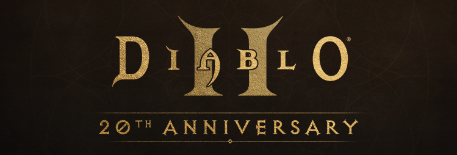

# My Old Games

There are some good games to play with,
This is how to play them with your modern buildings.

- [My Old Games](#my-old-games)
  - [Diablo II](#diablo-ii)
    - [Installation](#installation)
    - [High Resolution](#high-resolution)
    - [Easy to Use](#easy-to-use)

----
## Diablo II

> A CONFLICT AS OLD AS TIME ITSELF.
>
> NOT EVEN DEATH CAN SAVE YOU FROM ME.

### Installation

You can simply download it and its extension from the blizzard's website

- [Raw](https://www.blizzard.com/en-us/download/confirmation?platform=windows&locale=en_US&version=LIVE&id=d2 "Raw")

- [Extension](https://www.blizzard.com/en-us/download/confirmation?platform=windows&locale=en_US&product=d2lod "Extension")

### High Resolution

You may want it to be better to look at.

The [d2dx](https://git.ldqk.org/bolrog/d2dx "d2dx") project is developed to make it into higher resolution.

However, if you have downloaded it from the blizzard's website.
You will immediately get the error of

> Diablo II is unable to proceed. Unsupported graphics mode

For some reason, the author know the issue but he seems unwilling to publish the solution at current stage, as it writes

> You are running the download version of Diablo II from blizzard.com. This can be modified to work with D2DX (Wiki page about this to come).

So I dig deeper, and discovery something.
The high resolution solution uses an [OpenGL Wrapper](http://www.svenswrapper.de/english/ "OpenGL Wrapper"),
named as GLIDE3.
So, I **re-download** the proper wrapper from the website,
and **re-configure** the wrapper with the tool of `glide-init.exe`.
And, it works.

### Easy to Use

This part aims at fixing the Inner Issues for the Diablo Gamers.

The basic requirements of the Game are listed below:

1. Install Big and Shared Inventory System;
2. Add Ladder Contents and Equipments Support;
3. Allow Re-assigning the Abilities Points of the Characters.

The [PlugY](https://diablo-archive.fandom.com/wiki/PlugY "PlugY") package is developed to solve the issues.
And its usage is quite simple.